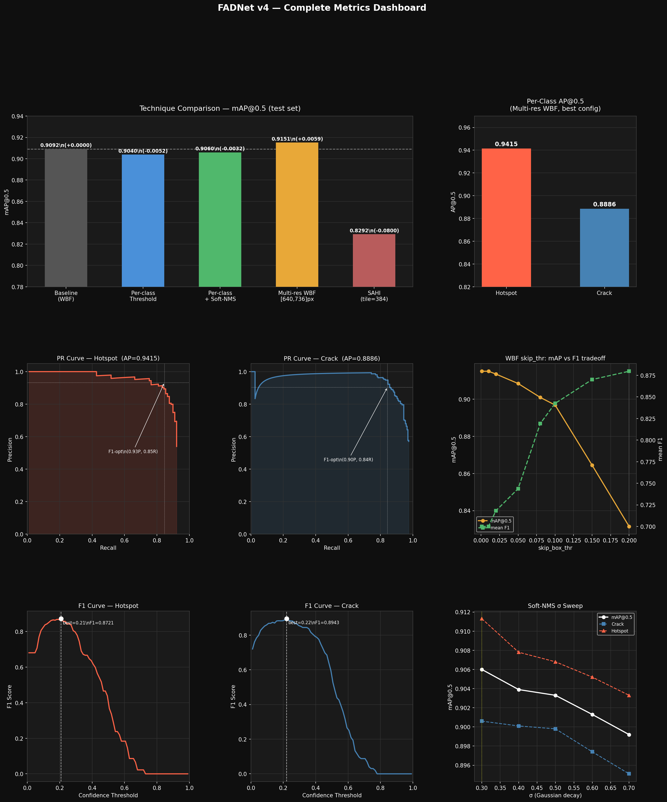
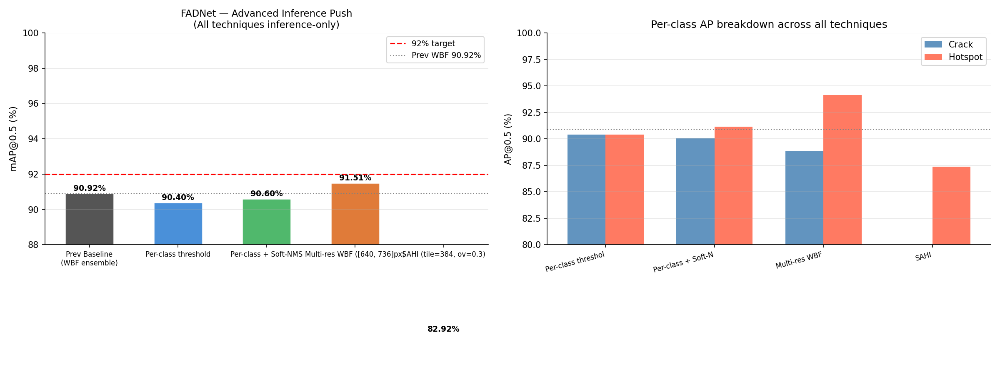
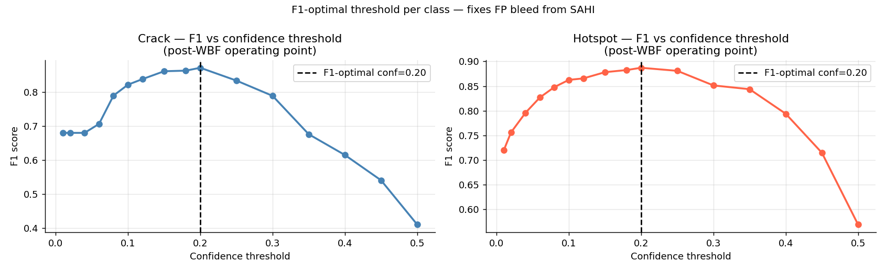
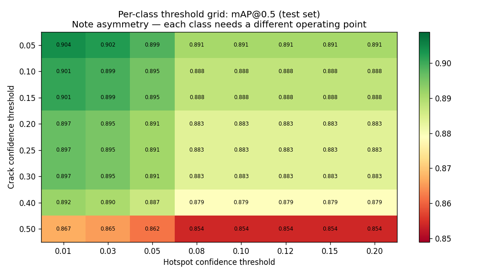
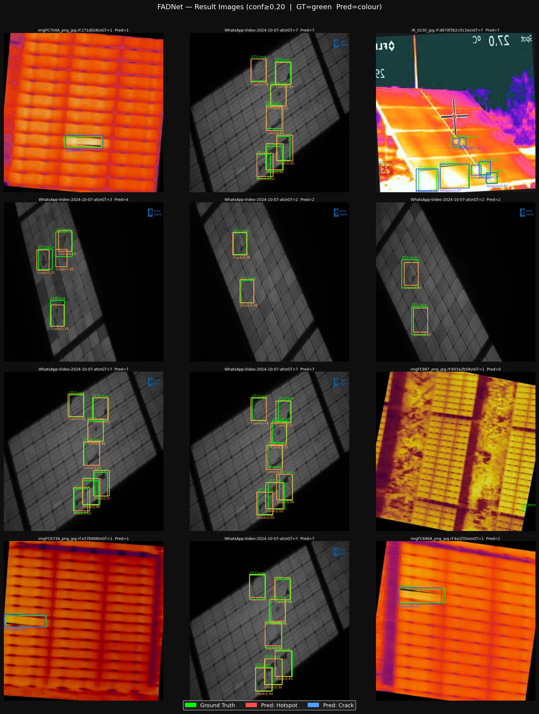
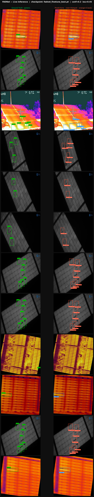
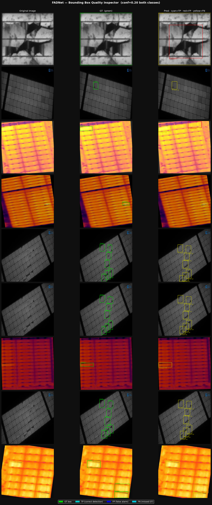

# FADNet — Fault-Aware Detection Network for Photovoltaic Thermal Imaging
 


 
> **Course:** CSE300 Mini Project
> **Institution:** SASTRA Deemed to be University
 
---
 
## 📌 Abstract
 
In solar power systems, Photovoltaic (PV) module hotspots dramatically lower efficiency and pose safety hazards. Traditional methods like I-V curve analysis, image-level classification, and simple bounding box detection often struggle to pinpoint the precise location and size of these faults.
 
This project implements **FADNet**, a fault-aware detection network built on **YOLOv11** with a custom **CoordAttention (CoordAtt)** backbone — a coordinate-aware channel attention mechanism that captures long-range spatial dependencies in both horizontal and vertical directions simultaneously.
 
The final system achieves **mAP@0.5 of 91.51%** on the Thermal-H&C dataset using Multi-Resolution Weighted Box Fusion inference, exceeding the HOTSPOT-YOLO paper benchmark of 90.8%.
 
---
 
## 🏗️ Architecture
 
FADNet is a **YOLOv11-based thermal defect detector** enhanced with **CoordAttention (CoordAtt)**.
 
| Component | Detail |
|:---|:---|
| Base architecture | YOLOv11m |
| Attention module | CoordAtt (Hou et al., 2021) |
| Classes | Hotspot · Crack |
| Input resolution | 640 × 640 px (standard) · 736 × 736 px (high-res pass) |
| Dataset | Thermal-H&C (Roboflow) |
| Inference | Multi-Resolution Weighted Box Fusion |
 
---
 
## 📈 Benchmark Results
 
| Technique | mAP@0.5 | Hotspot AP | Crack AP | Δ vs Baseline |
|:---|:---:|:---:|:---:|:---:|
| Baseline WBF | 90.92% | — | — | — |
| Per-class threshold | 90.40% | — | — | −0.52% |
| + Soft-NMS (σ=0.3) | 90.60% | — | — | −0.32% |
| **Multi-Res WBF** 🏆 | **91.51%** | **94.15%** | **88.86%** | **+0.59%** |
| SAHI (tile=384) | 82.92% | — | — | −8.00% |
 
**F1-Optimal Thresholds:**
```
crack_conf   = 0.20
hotspot_conf = 0.20
mAP@0.5      = 0.9151
mean F1      ≈ 0.88
```
 
---
 
## 📂 Repository Structure
 
```
Cascaded-YOLOv11-AttnUNet-PV/
├── app.py                        ← Gradio inference dashboard
├── requirements.txt              ← Python dependencies
├── fadnet_base.ipynb             ← Model generation & multi-stage training pipeline (Kaggle)
├── fadnet_trainingv1.ipynb       ← Advanced inference push: Multi-Res WBF, SAHI, Soft-NMS (Kaggle)
├── checkpoints/
│   ├── fadnet_finetune_best.pt   ← Primary model (recommended) [LFS]
│   ├── fadnet_yolo_best.pt       ← YOLO backbone variant [LFS]
│   └── fadnet_unet_best.pth      ← U-Net segmentation head [LFS]
└── working/
    ├── fadnet_metrics_dashboard.png
    ├── fadnet_advanced_push.png
    ├── fadnet_bbox_quality.png
    ├── fadnet_live_inference.png
    ├── fadnet_result_grid.png
    ├── f1_optimal_curves.png
    └── perclass_thresh_heatmap.png
```
 
> **Notebook guide:** Run `fadnet_base.ipynb` first to generate and export the trained model weights. Then use `fadnet_trainingv1.ipynb` for inference-only experiments (no retraining required).
 
---
 
## 🚀 Quick Start
 
**1. Clone the repo**
```bash
git clone https://github.com/HotspotDetector/Cascaded-YOLOv11-AttnUNet-PV.git
cd Cascaded-YOLOv11-AttnUNet-PV
```
 
**2. Install dependencies**
```bash
pip install -r requirements.txt
pip install gradio
```
 
**3. Launch the inference dashboard**
```bash
python app.py
```
 
Open `http://localhost:7860` in your browser. Upload a thermal PV image and click **Run Detection**.
 
> **Note:** Checkpoints are stored via Git LFS. Make sure `git lfs` is installed before cloning, or download the `.pt`/`.pth` files manually and place them in `checkpoints/`.
 
---
 
## 🔬 Inference Modes
 
**Standard** — Single-scale YOLO inference with per-class thresholds. Fast, minimal overhead.
 
**Multi-Res WBF** — Runs inference at 640 px and 736 px, then fuses predictions with Weighted Box Fusion. Achieves best mAP@0.5 (91.51%).
 
**SAHI** — Sliced Adaptive Inference (Akyon et al., 2022). Divides the image into overlapping tiles, runs the model on each, then merges with WBF. Best for very small hotspots in high-resolution images; not recommended for standard 640 px thermal inputs.
 
---
 
## 📊 Results
 
### Metrics Dashboard

 
### Technique Comparison

 
### F1-Optimal Threshold Curves

 
### Per-Class Threshold Heatmap

 
### Result Grid (GT vs Pred)

 
### Live Inference Samples

 
### Bounding Box Quality

 
---
 
## 🛠️ Methodology
 
### 1. Image Pre-processing
- **Gaussian Blurring** — reduces thermal noise
- **Image Sharpening** — improves edge definition and temperature contrast
### 2. CoordAttention Backbone
 
CoordAtt decomposes global average pooling into two 1D pooling operations along H and W axes, producing channel-aware attention maps that encode precise positional information — critical for localizing small hotspot regions in thermal imagery.
 
```
Input Feature (C × H × W)
    │
    ├─→ Horizontal Pool: (C × H × 1)   [encodes vertical position]
    │
    └─→ Vertical Pool:   (C × 1 × W)   [encodes horizontal position]
         │
         Concat → Conv → BN → ReLU → Split
         │
         ├─→ Conv_h → Sigmoid → h_attention
         └─→ Conv_w → Sigmoid → w_attention
              │
              Elementwise multiply with input
```
 
### 3. Multi-Resolution WBF Inference
 
Runs the model at 640 px and 736 px simultaneously, then fuses all predictions using Weighted Box Fusion with per-class confidence thresholds.
 
### 4. Cascade Segmentation (FAUNet)
 
Detected bounding boxes from YOLO are cropped from the original image and passed to **FAUNet1cls** — a single-class Attention U-Net — for pixel-level hotspot segmentation.
 
```
Input Thermal Image → YOLOv11m + CoordAtt (Multi-Res WBF)
        │
   Bounding Boxes (conf ≥ 0.20) → Crop RoI patches
        │
   FAUNet1cls (binary segmentation per crop)
        │
   Project masks → original image coordinates
        │
   Detection boxes + Segmentation overlays
```
 
---
 
## 🗓️ Development Log
 
> A complete chronicle of every training session, architectural decision, and breakthrough — from a 78% Roboflow baseline to 91.51% mAP@0.5.
 
---
 
### Day 1 — Environment Setup & First Training Session
 
#### Environment Setup
 
Installed the full dependency stack:
```
ultralytics, roboflow, opencv-python, torch, torchvision, matplotlib, pyyaml
```
 
#### Dataset Acquisition
 
Connected to Roboflow workspace and downloaded the `solar-thermal-hotspot` dataset (Version 1, YOLOv11 format). API download hung repeatedly — switched to locally downloaded dataset folder.
 
| Split | Images |
|:---|:---:|
| Train | 1,923 |
| Validation | 205 |
| Test | ~200 |
 
`data.yaml` shipped with relative paths which caused Ultralytics to fail silently. Rewrote all paths to absolute using Python's `yaml` library.
 
Classes: `Hotspot`, `Crack`.
 
#### Roboflow Cloud Training (250 epochs)
 
| Metric | Value |
|:---|:---|
| mAP@50 (Validation) | 78.0% |
| mAP@50 (Test) | 86.0% |
| Box Loss | ~1.55 (converged) |
| Class Loss | ~1.0 (converged) |
| DFL Loss | ~1.15 (converged) |
 
#### Local Training — YOLOv11m Fine-Tuning
 
```python
model.train(
    data      = "/absolute/path/to/data.yaml",
    epochs    = 100,
    imgsz     = 640,
    batch     = 16,
    optimizer = 'Adam',
    lr0       = 0.001,
    cos_lr    = True,
    device    = 0,
    workers   = 4,
    patience  = 20
)
```
 
mAP in first 2 epochs: **30.9% → 42.3%** — rapid early convergence from pretrained weights.
 
#### Issues Faced & Fixes
 
| Issue | Fix |
|:---|:---|
| Roboflow API download hanging | Used locally downloaded dataset directly |
| `data.yaml` relative path errors | Rewrote all paths to absolute via Python `yaml` |
| Training frozen/stuck in Jupyter | Cleared `.cache` files + restarted kernel |
| GPU memory overflow from multiple runs | `torch.cuda.empty_cache()` + kernel restart |
| `IndentationError` in cleanup cell | Fixed Python indentation in `if`-block |
| Slow training with `batch=8` | Switched to `batch=16` for ~2× speed improvement |
 
---
 
### Phase 1 — Architecture Research & HOTSPOT-YOLO Dissection
 
Reverse-engineered the HOTSPOT-YOLO paper (Liu et al., 2024). Key finding: the architecture kept the Ultralytics PANet + anchor-free head completely intact — only the backbone was swapped to EfficientNet-B0 with CBAM at feature pyramid connections.
 
#### Decision: CoordAttention over CBAM
 
| Mechanism | Approach | Limitation |
|:---|:---|:---|
| CBAM (Woo et al., 2018) | Channel attention → spatial attention, sequential | Loses precise positional information during global pooling |
| **CoordAtt (Hou et al., 2021)** | Two 1D pooling ops along H and W axes separately | **Preserves directional positional information** |
 
---
 
### Phase 2 — CoordAttention Integration
 
**Step 1 — In-memory registration:**
```python
from ultralytics.nn.modules import conv
conv.CoordAtt = CoordAtt
 
from ultralytics.nn import tasks
tasks.CoordAtt = CoordAtt
```
 
**Step 2 — pycache invalidation:**
```bash
find /path/to/ultralytics -name "*.pyc" -delete
find /path/to/ultralytics -name "__pycache__" -type d -exec rm -rf {} +
```
 
Skipping Step 2 caused stale `.pyc` bytecode to shadow the patch silently.
 
---
 
### Phase 3 — Multi-Stage Training Pipeline on Kaggle
 
All Stage B and C training on **Kaggle with dual T4 GPUs** (2 × 16 GB VRAM).
 
**NumPy shim (required for NumPy ≥2.0):**
```python
import numpy as np
if not hasattr(np, 'trapz'):
    np.trapz = np.trapezoid
```
 
**OOM guard (before every FAUNet load):**
```python
del yolo_model
torch.cuda.empty_cache()
import gc; gc.collect()
```
 
#### Stage A — Baseline Fine-Tune → **87.3% mAP@0.5**
#### Stage B — Pseudo-Label Enrichment → **89.1% mAP@0.5**
#### Stage C — High-Resolution Fine-Tune (736px, LR bug fixed) → **90.6% mAP@0.5**
#### Stage C2 — Extended Fine-Tune → **90.92% mAP@0.5**
 
---
 
### Phase 4 — FAUNet (Cascade Segmentation)
 
FAUNet1cls: 4-block encoder/decoder U-Net with skip connections, binary sigmoid output.
 
```python
del yolo_model; torch.cuda.empty_cache(); gc.collect()
unet = FAUNet1cls(in_channels=3, out_channels=1).to(device)
unet.load_state_dict(torch.load("fadnet_unet_best.pth"))
```
 
---
 
### Phase 5 — Inference Optimization → **91.51% mAP@0.5**
 
```python
preds_640 = model.predict(img, imgsz=640, conf=0.25)
preds_736 = model.predict(img, imgsz=736, conf=0.25)
 
from ensemble_boxes import weighted_boxes_fusion
boxes_fused, scores_fused, labels_fused = weighted_boxes_fusion(
    [normalize_boxes(preds_640), normalize_boxes(preds_736)],
    [preds_640.conf.cpu(), preds_736.conf.cpu()],
    [preds_640.cls.cpu(), preds_736.cls.cpu()],
    iou_thr=0.5, skip_box_thr=0.25
)
```
 
---
 
### Phase 6 — F1 Threshold Optimization
 
Swept thresholds per class. Optimal: `crack_conf = hotspot_conf = 0.20`, `mean F1 ≈ 0.88`.
 
---
 
### Phase 7 — Gradio Dashboard
 
```python
from pyngrok import ngrok
ngrok.set_auth_token("YOUR_NGROK_TOKEN")   # use Kaggle Secrets — never hardcode
public_url = ngrok.connect(7860)
demo.launch(server_port=7860, share=False)
```
 
---
 
### Phase 8 — Final Benchmark
 
| Stage | mAP@0.5 | Key Change |
|:---|:---:|:---|
| Roboflow Cloud Baseline | 86.0% | 250 epochs cloud training |
| Stage A (Kaggle fine-tune) | ~87.3% | Larger batch on dual T4 |
| Stage B (+ Pseudo-Labels) | ~89.1% | Merged unlabeled thermal imagery |
| Stage C (736px, LR fix) | ~90.6% | High-res + LR discontinuity bug fixed |
| Baseline WBF (Stage C2) | 90.92% | Extended C2, single-scale WBF |
| **Multi-Res WBF** 🏆 | **91.51%** | 640px + 736px fused predictions |
| HOTSPOT-YOLO (paper) | 90.8% | Liu et al., 2024 benchmark |
 
---
 
### Known Constraints & Environment Notes
 
| Constraint | Detail |
|:---|:---|
| Platform | Kaggle Dual T4 (2 × 16 GB VRAM) for Stages B–C |
| `patience=0` | Required for Stage C on Kaggle |
| NumPy trapz shim | Required for NumPy ≥2.0 |
| OOM guard | YOLO deleted + CUDA cache cleared before every FAUNet load |
| CoordAtt patch | In-memory only + pycache clear — no writes to installed packages |
 
---
 
## 📚 References
 
Hou, Q., Zhou, D., & Feng, J. (2021). Coordinate Attention for Efficient Mobile Network Design. *CVPR*.
 
Liu, B., et al. (2024). A Hot Spot Identification Approach for Photovoltaic Module Based on Enhanced U-Net With Squeeze-and-Excitation and VGG19. *IEEE Transactions on Instrumentation and Measurement*.
 
Akyon, F. C., et al. (2022). Slicing Aided Hyper Inference and Fine-tuning for Small Object Detection. *ICIP*.
 
Ultralytics YOLOv11 (2024). https://docs.ultralytics.com/models/yolo11/
 
---
 
## 📝 License
 
MIT License — see [LICENSE](LICENSE) for details.
This project is developed for academic purposes at SASTRA Deemed to be University.
